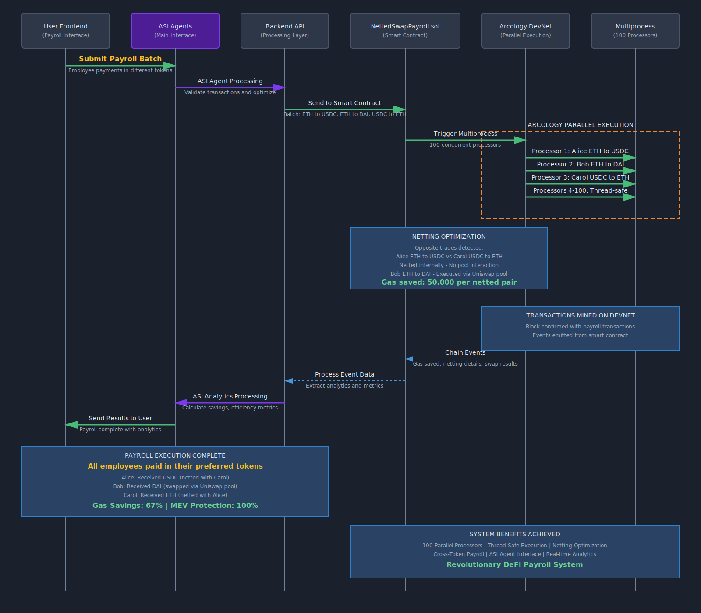

ZeroMEV
> *"MEV Protection is no more an option"*

**Built for ETHOnline 2025**

ZeroMEV is a revolutionary DeFi trading platform that uses AI-powered parallel execution simulation to protect users from MEV attacks.
Leveraging **Arcology Network**, **Pyth Network**, **Blockscout**, and **ASI:One with MeTTa consensus**, it shows you what will happen **before** you trade, allowing you to make informed decisions about timing, gas prices, and execution strategies.

## 🌟 Key Features

- **🔮 Parallel Simulation**: Run 100+ trade simulations across different timing and gas conditions using **Arcology Network**
- **🤖 AI Agent Consensus**: Multi-agent AI system powered by **ASI:One** debates and reaches consensus on optimal execution using **MeTTa reasoning**
{{ ... }}
- **🛡️ MEV Detection**: Identify sandwich attacks and frontrunning patterns using **Blockscout** historical analysis
- **📊 Real-time Price Feeds**: Get accurate, live market data from **Pyth Network** with confidence intervals
- **📈 Visual Analysis**: Beautiful, modern UI showing all possible trade outcomes with detailed reasoning
- **⚡ Real-time Execution**: Get comprehensive analysis in under 10 seconds
- **🎯 Smart Timing**: Know exactly when to execute for maximum profit and minimum MEV exposure

## 🔄 Complete System Flow

The diagram below shows the complete end-to-end flow of how ZeroMEV protects users from MEV attacks using parallel simulations and AI consensus:



### Flow Breakdown:
1. **User Input**: Submit trade parameters (token pair, amount, risk preference)
2. **Data Gathering**: Fetch real-time mempool state from Blockscout and price data from Pyth
3. **Parallel Simulation**: Arcology Network runs 100+ scenarios across different blocks and gas prices
4. **AI Analysis**: Multiple specialized agents analyze results using ASI:One reasoning
5. **Consensus Decision**: MeTTa consensus engine determines optimal execution strategy
6. **User Confirmation**: Display predictions with countdown timer
7. **Smart Execution**: Queue transaction for optimal timing with continuous re-evaluation

## 🏗️ Architecture

```
┌─────────────────┐    ┌─────────────────┐    ┌─────────────────┐
│   Frontend      │    │   MeTTa API     │    │  Smart Contracts│
│   (Next.js)     │◄──►│   (FastAPI)     │    │   (Solidity)    │
│                 │    │                 │    │                 │
│ • Trading UI    │    │ • AI Agents     │    │ • MEV Protection│
│ • Visualization │    │ • Consensus     │    │ • Trade Executor│
│ • User Controls │    │ • ASI:One       │    │ • Queue System  │
└─────────────────┘    └─────────────────┘    └─────────────────┘
         │                       │                       │
         └───────────────────────┼───────────────────────┘
                                 │
         ┌─────────────────────────────────────────────────┐
         │              External Services                  │
         │                                                 │
         │ • Arcology Network (Parallel Execution)        │
         │ • ASI:One (AI Reasoning)                       │
         │ • Blockscout (Mempool Data)                    │
         │ • Pyth Oracle (Price Feeds)                    │
         └─────────────────────────────────────────────────┘
```

## 🚀 Quick Start

### Prerequisites

- Node.js 18+
- Python 3.9+
- Git

### 1. Clone the Repository

```bash
git clone https://github.com/your-org/ZeroMEV.git
cd ZeroMEV
```

### 2. Setup Frontend

```bash
cd frontend
npm install
npm run dev
```

The frontend will be available at `http://localhost:3000`

### 3. Setup MeTTa Service

```bash
cd ../metta
python -m venv .venv
source .venv/bin/activate  # On Windows: .venv\Scripts\activate
pip install -r requirements.txt

# Optional: Set ASI:One API key for enhanced AI reasoning
export ASI_ONE_API_KEY="your-api-key-here"

uvicorn main:app --reload --port 8000
```

The MeTTa API will be available at `http://localhost:8000`

### 4. Setup Smart Contracts (Optional)

```bash
cd ../block
npm install

# Copy environment template
cp .env.example .env
# Edit .env with your RPC URLs and private keys

# Deploy to local network
npm run deploy:local

# Deploy to Base Sepolia testnet
npm run deploy:base-sepolia
```

## 📁 Project Structure

```ZeroMEV/
├── frontend/              # Next.js 14 frontend application
│   ├── src/
│   │   ├── app/
│   │   │   ├── api/       # API routes for orchestration
│   │   │   ├── trade/     # Main trading interface
│   │   │   └── globals.css
│   │   └── lib/           # Utility functions
│   ├── package.json
│   └── README.md
│
├── metta/                 # FastAPI service for AI analysis
│   ├── agents/            # Individual AI agents
│   │   ├── mev_agent.py   # MEV protection specialist
│   │   ├── profit_agent.py # Profit maximization specialist
│   │   ├── speed_agent.py  # Speed optimization specialist
│   │   └── consensus_agent.py # MeTTa consensus reasoning
│   ├── main.py            # FastAPI application
│   └── requirements.txt
│
├── block/                 # Smart contracts and deployment
│   ├── contracts/
│   │   ├── SimUFiExecutor.sol           # Trade execution contract
│   │   ├── MEVProtection.sol            # MEV detection contract
│   │   ├── ArcologyOrchestrator.sol     # Multi-chain coordination hub
│   │   └── ChainSimulationExecutor.sol  # Per-chain simulation executor
│   ├── scripts/
│   │   ├── deploy.js                    # Original deployment script
│   │   ├── deploy-arcology-orchestrator.js  # Arcology orchestrator deployment
│   │   ├── deploy-chain-executor.js     # Per-chain executor deployment
│   │   └── deploy-all-chains.js         # Automated multi-chain deployment
│   ├── hardhat.config.js
│   └── package.json
│
├── flow/                  # Architecture diagrams
└── README.md             # This file
```

## 🔧 API Documentation

### Frontend API Routes

#### `POST /api/orchestrate`
Master endpoint that coordinates the entire simulation → decision flow.

**Request:**
```json
{
  "wallet_address": "0x742d35Cc6634C0532925a3b844Bc9e7595f0bEb",
  "trade": {
    "from_token": "ETH",
    "to_token": "USDC",
    "amount": "5.0",
    "chain": "base"
  },
  "user_priority": "balanced",
  "risk_tolerance": "balanced",
  "max_wait_blocks": 5,
  "auto_execute": false
}
```

**Response:**
```json
{
  "request_id": "req_abc123",
  "status": "ready",
  "recommendation": {
    "execute_at_block": 19234567,
    "blocks_to_wait": 3,
    "expected_output_usd": "15120.45",
    "confidence": 92,
    "savings_vs_immediate": "124.00"
  },
  "agent_reasoning": {
    "mev_agent": "Option 2 avoids 3 detected sandwich bots",
    "profit_agent": "Option 2 yields $120 more than immediate execution",
    "consensus": "Recommended option balances MEV safety with profit"
  }
}
```

#### Advanced API Routes

- `GET /api/get_trade?request_id=<id>` - Retrieve comprehensive trade analysis status and results
- `GET /api/mempool?chain=<chain>` - Real-time mempool analysis with MEV risk assessment
- `GET /api/mempool?chain=<chain>&live=true` - Live blockchain RPC analysis for real-time MEV detection
- `GET /api/mempool?chain=<chain>&blockscout=true` - Historical MEV pattern analysis via Blockscout API
- `POST /api/get_price` - Multi-source price aggregation with volatility analysis
- `POST /api/simulate` - **Multi-Chain Parallel Execution**: Orchestrates 100+ scenarios across 5 testnets via Arcology Network
- `POST /api/analyze` - Multi-agent AI consensus analysis with MEV risk scoring
- `POST /api/approve` - Secure trade approval with optimal timing execution

### MeTTa Service API

#### `POST /analyze`
Multi-agent analysis of trade simulations.

**Request:**
```json
{
  "simulations": [...],
  "user_priority": "mev_protection",
  "risk_tolerance": "balanced",
  "user_context": {
    "trade_size_usd": 15000,
    "is_time_sensitive": false
  }
}
```

**Response:**
```json
{
  "consensus_recommendation": {
    "recommended_id": 14,
    "confidence": 92,
    "reasoning": "...",
    "agent_agreement": "2/3 agents agree (mev + profit)"
  },
  "mev_protection_agent": {...},
  "profit_maximizer_agent": {...},
  "speed_optimizer_agent": {...}
}
```

## 🤖 AI Agent System

ZeroMEV uses a sophisticated multi-agent AI system where specialized agents analyze trade simulations:

### 1. MEV Protection Agent
- **Focus**: Minimize MEV risk and protect from sandwich attacks
- **Analysis**: Mempool bot detection, risk scoring, timing optimization
- **Output**: Safest execution strategy

### 2. Profit Maximizer Agent  
- **Focus**: Maximize net profit after gas costs and MEV risks
- **Analysis**: Net profit calculation, cost-benefit analysis
- **Output**: Most profitable execution strategy

### 3. Speed Optimizer Agent
- **Focus**: Minimize execution time while maintaining acceptable profit
- **Analysis**: Time vs profit tradeoffs, market volatility exposure
- **Output**: Fastest acceptable execution strategy

### 4. Consensus Agent (MeTTa + ASI:One)
- **Focus**: Combine agent recommendations based on user priorities
- **Analysis**: Weighted scoring, conflict resolution, final decision
- **Output**: Optimal balanced recommendation

## 🛡️ Advanced MEV Protection System

### Multi-Source MEV Analysis
- **Real-time Blockchain Analysis**: Direct RPC connection for live mempool monitoring and pending transaction analysis
- **Blockscout Integration**: Historical MEV pattern analysis using confirmed transaction data
- **Hybrid Detection**: Combines real-time and historical data for comprehensive MEV risk assessment

### Detection Mechanisms
- **Sandwich Attack Patterns**: Advanced pattern recognition identifying high-gas transactions surrounding user trades
- **MEV Bot Identification**: Machine learning-based detection of known MEV bot addresses and behaviors
- **Mempool State Analysis**: Real-time monitoring of transaction pool conditions and gas price anomalies
- **Cross-block Pattern Analysis**: Historical analysis of MEV attack patterns across multiple blocks

### Protection Strategies
- **Predictive Timing Optimization**: AI-powered analysis determines optimal execution timing to minimize MEV exposure
- **Dynamic Gas Price Calculation**: Intelligent gas pricing to avoid sandwich attack windows
- **Multi-scenario Simulation**: Parallel execution of 100+ scenarios to identify safest execution paths
- **Adaptive Slippage Protection**: Real-time slippage adjustment based on current MEV risk levels

## 🎨 UI/UX Features

### Modern Design System
- **Typography**: Unbounded (headings), Space Grotesk (body), Bricolage Grotesque (subheadings)
- **Color Palette**: Blue-purple gradients with high contrast accessibility
- **Responsive**: Mobile-first design with desktop optimization
- **Dark Mode**: Full dark mode support

### Trading Interface
- **Intuitive Controls**: Simple token selection and amount input
- **Priority Selection**: Choose between MEV protection, profit, speed, or balanced
- **Real-time Analysis**: Live updates during simulation process
- **Visual Results**: Clear comparison of simulation outcomes
- **Agent Reasoning**: Transparent AI decision-making process

## 🔗 Sponsor Technology Integration

### Arcology Network - Multi-Chain Orchestration
- **Usage**: Advanced multi-chain parallel execution orchestration layer
- **Integration**: 
  - **Orchestrator Contract**: Deployed on Arcology Network as the main coordination hub
  - **Cross-Chain Execution**: Distributes 100+ simulations across 5 testnets (Base, Optimism, Arbitrum, Polygon, Ethereum)
  - **Load Balancing**: Intelligent round-robin distribution with real-time chain availability monitoring
  - **Real Mempool Integration**: Live mempool data from Blockscout on each target chain
- **Technical Innovation**: 
  - Smart contract orchestration with off-chain TypeScript relayer
  - Automatic fallback mechanisms for development and production environments
  - Cross-chain result aggregation with MEV risk analysis per chain
- **Benefit**: True multi-chain parallel execution providing comprehensive MEV protection across entire ecosystem

### ASI Alliance (ASI:One)
- **Usage**: Advanced AI reasoning for consensus decisions
- **Integration**: Multi-agent system coordination and decision making
- **Benefit**: Sophisticated analysis combining multiple AI perspectives

### Blockscout
- **Usage**: Historical blockchain data analysis and MEV pattern recognition
- **Integration**: Multi-chain transaction analysis and confirmed MEV attack detection
- **Benefit**: Comprehensive historical MEV data for pattern learning and risk assessment

### Pyth Oracle
- **Usage**: Real-time price feeds and volatility data
- **Integration**: Accurate token pricing for profit calculations
- **Benefit**: Reliable price data for simulation accuracy

## 🧪 Testing & Validation

### Multi-Chain Parallel Execution Testing
```bash
cd frontend/scripts
node parallel.js
```
Comprehensive test suite validating:
- Arcology orchestrator contract functionality
- Cross-chain executor deployment and communication
- Multi-chain simulation distribution and aggregation
- Real-time mempool integration across 5 testnets
- Load balancing and failover mechanisms

### MEV Analysis Testing
```bash
cd frontend/scripts
node MEV.js
```
Comprehensive test suite validating:
- Real-time blockchain MEV detection
- Blockscout historical analysis integration
- Multi-chain compatibility
- API endpoint functionality

### Frontend Testing
```bash
cd frontend
npm test
```

### MeTTa Service Testing
```bash
cd metta
python -m pytest tests/
```

### Smart Contract Testing
```bash
cd block
npm test
```

## 🚀 Deployment

### Frontend (Vercel)
```bash
cd frontend
npm run build
# Deploy to Vercel or your preferred platform
```

### MeTTa Service (Docker)
```bash
cd metta
docker build -t zeromev-metta .
docker run -p 8000:8000 zeromev-metta
```

### Smart Contracts

#### Multi-Chain Arcology Deployment
```bash
cd block

# 1. Deploy Arcology Orchestrator (main coordination hub)
npx hardhat run scripts/deploy-arcology-orchestrator.js --network arcology-testnet

# 2. Deploy executors to all 5 testnets automatically
npx hardhat run scripts/deploy-all-chains.js

# 3. Deploy to specific chains individually (alternative)
npx hardhat run scripts/deploy-chain-executor.js --network base-sepolia
npx hardhat run scripts/deploy-chain-executor.js --network optimism-sepolia
npx hardhat run scripts/deploy-chain-executor.js --network arbitrum-sepolia
npx hardhat run scripts/deploy-chain-executor.js --network polygon-mumbai
npx hardhat run scripts/deploy-chain-executor.js --network sepolia

# 4. Verify contracts
npm run verify:base <contract-address>
```

#### Traditional Single-Chain Deployment
```bash
cd block
# Deploy to Base mainnet
npm run deploy:base

# Verify contracts
npm run verify:base <contract-address>
```

## 🔐 Environment Variables

### Frontend (.env.local)
```
# Core Services
NEXT_PUBLIC_METTA_SERVICE_URL=http://localhost:8000
NEXT_PUBLIC_CHAIN_ID=8453

# Arcology Multi-Chain Configuration
ARCOLOGY_TESTNET_RPC_URL=https://testnet.arcology.network/rpc
ARCOLOGY_ORCHESTRATOR_ADDRESS=0x...
RELAYER_PRIVATE_KEY=0x...

# Multi-Chain RPC URLs
BASE_SEPOLIA_RPC_URL=https://sepolia.base.org
OPTIMISM_SEPOLIA_RPC_URL=https://sepolia.optimism.io
ARBITRUM_SEPOLIA_RPC_URL=https://sepolia-rollup.arbitrum.io/rpc
POLYGON_MUMBAI_RPC_URL=https://rpc-mumbai.maticvigil.com
ETHEREUM_SEPOLIA_RPC_URL=https://sepolia.infura.io/v3/YOUR_KEY

# Executor Contract Addresses
BASE_EXECUTOR_ADDRESS=0x...
OPTIMISM_EXECUTOR_ADDRESS=0x...
ARBITRUM_EXECUTOR_ADDRESS=0x...
POLYGON_EXECUTOR_ADDRESS=0x...
ETHEREUM_EXECUTOR_ADDRESS=0x...
```

### MeTTa Service (.env)
```
ASI_ONE_API_KEY=your-asi-one-api-key
PYTH_API_KEY=your-pyth-api-key
```

### Smart Contracts (.env)
```
# Deployment Configuration
PRIVATE_KEY=your-deployment-private-key
RELAYER_PRIVATE_KEY=your-relayer-private-key

# Arcology Network
ARCOLOGY_TESTNET_RPC_URL=https://testnet.arcology.network/rpc
ARCOLOGY_ORCHESTRATOR_ADDRESS=

# Multi-Chain RPC URLs
BASE_SEPOLIA_RPC_URL=https://sepolia.base.org
OPTIMISM_SEPOLIA_RPC_URL=https://sepolia.optimism.io
ARBITRUM_SEPOLIA_RPC_URL=https://sepolia-rollup.arbitrum.io/rpc
POLYGON_MUMBAI_RPC_URL=https://rpc-mumbai.maticvigil.com
ETHEREUM_SEPOLIA_RPC_URL=https://sepolia.infura.io/v3/YOUR_KEY

# API Keys for Contract Verification
BASESCAN_API_KEY=your-basescan-api-key
OPTIMISTIC_ETHERSCAN_API_KEY=your-optimistic-etherscan-api-key
ARBISCAN_API_KEY=your-arbiscan-api-key
POLYGONSCAN_API_KEY=your-polygonscan-api-key
ETHERSCAN_API_KEY=your-etherscan-api-key
```

## 🤝 Contributing

We welcome contributions! Please see our [Contributing Guide](CONTRIBUTING.md) for details.

### Development Workflow
1. Fork the repository
2. Create a feature branch
3. Make your changes
4. Add tests
5. Submit a pull request

## 📄 License

This project is licensed under the MIT License - see the [LICENSE](LICENSE) file for details.

## 🏆 ETHOnline 2025

ZeroMEV was built for ETHOnline 2025, demonstrating:

- **Innovation**: First predictive MEV protection platform with multi-chain parallel execution
- **Technical Excellence**: Multi-agent AI system with real-time blockchain integration across 5 networks
- **Advanced Multi-Chain Architecture**: Arcology Network orchestrating parallel simulations across Base, Optimism, Arbitrum, Polygon, and Ethereum
- **Cross-Chain MEV Detection**: Real-time mempool analysis on each chain with Blockscout integration
- **Sponsor Integration**: Deep technical integration showcasing Arcology's parallel execution capabilities
- **Production-Ready Infrastructure**: Complete deployment automation for 6 smart contracts across multiple networks
- **User Experience**: Beautiful, intuitive interface making complex multi-chain MEV protection accessible
- **Real Impact**: Production-ready solution providing comprehensive MEV protection across the entire DeFi ecosystem

## 🙏 Acknowledgments

- ETHGlobal for hosting an amazing hackathon
- Arcology Network for parallel execution infrastructure and NettedAMM Infrastructure
- ASI Alliance for advanced agentic capabilities and MeTTa solvers.
- Blockscout for blockchain data access
- Pyth Oracle for reliable price feeds
- The entire DeFi community for inspiration and support

---

**Built with ❤️ for the future of MEV-protected trading**
